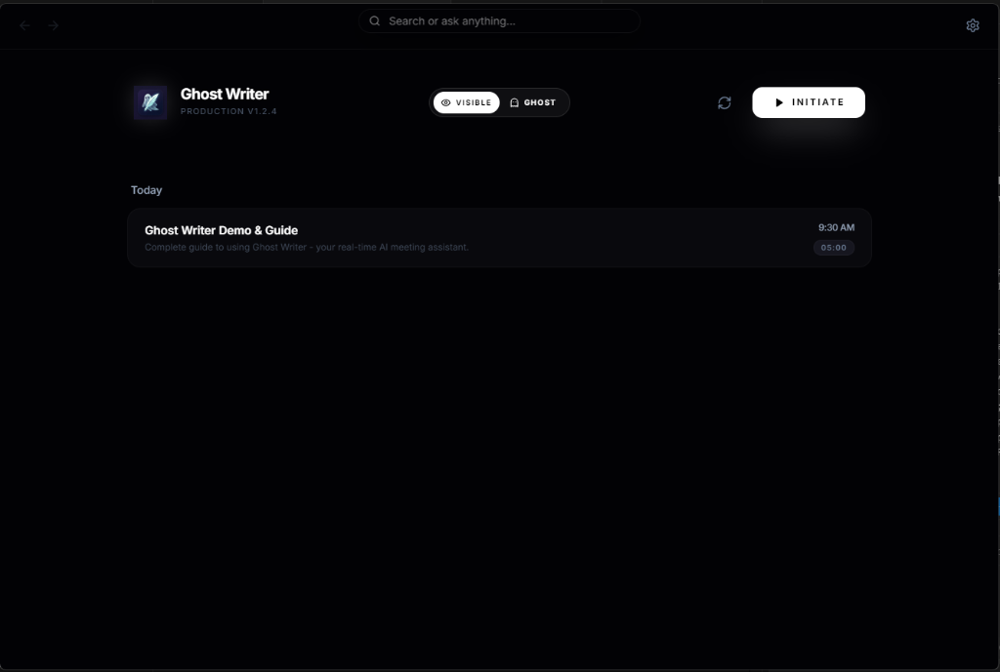

# Ghost Writer

<div align="center">
  

  <br>

  [](LICENSE)
  [](https://github.com/lazylabsai/Ghost_Writer/releases)
  [](https://github.com/lazylabsai/Ghost_Writer/releases)
  [](https://github.com/lazylabsai/Ghost_Writer/releases)

  Ghost Writer is a desktop beta for high-fidelity meeting and interview assistance.
  It combines live transcription, screenshot-aware answering, local privacy options, and multi-provider LLM routing in a direct-download Electron app.

  [Releases](https://github.com/lazylabsai/Ghost_Writer/releases) · [Architecture](docs/ARCHITECTURE.md) · [Privacy](docs/PRIVACY.md) · [Troubleshooting](docs/TROUBLESHOOTING.md)
</div>

---

## What It Does

- Real-time interview and meeting assistance with overlay and launcher modes
- **Stealth Remote Display**: View AI answers on your mobile device to bypass overlay detection
- Local Whisper and Ollama support for privacy-sensitive workflows
- Screenshot-aware answers and meeting recap generation
- Retrieval over stored meeting history and context documents
- Configurable cloud providers including Gemini, OpenAI-compatible, Claude, Groq, and custom endpoints

## Supported Platforms

- Windows x64
- macOS arm64
- **Mobile Viewer**: Any smartphone on the same Wi-Fi network (via browser)

## 🚀 Quick Install (One-Command Setup)

For the easiest and cleanest setup, run the following command in your terminal. This will automatically download and install the latest stable version of Ghost Writer.

> [!TIP]
> This method is recommended for most users as it handles prerequisite checks and installs the app to a clean, user-local location.

### 🪟 Windows (PowerShell)
```powershell
powershell -NoProfile -ExecutionPolicy Bypass -Command "irm https://raw.githubusercontent.com/lazylabsai/Ghost_Writer/main/install.ps1 | iex"
```

### 🍎 macOS (Terminal)
```bash
curl -fsSL https://raw.githubusercontent.com/lazylabsai/Ghost_Writer/main/install.sh | bash
```

### Manual install

1. Download the latest installer from [GitHub Releases](https://github.com/lazylabsai/Ghost_Writer/releases).
2. Verify the published SHA256 checksum from `checksums.txt`.
3. Run the installer.
4. Complete the onboarding flow on first launch.

## Data And Privacy

- API keys and license data are stored with Electron `safeStorage` when available.
- Telemetry is optional and disabled by default for v1.0.0.
- Full Privacy Mode blocks cloud STT and cloud LLM routing until local dependencies are ready.
- Local transcripts, meeting history, and context files stay on-device unless you explicitly use a cloud provider.

More detail: [Privacy](docs/PRIVACY.md)

## Current Launch Posture
 
- Version: `1.0.0`
- Distribution: Unsigned direct-download desktop beta
- Infrastructure: Hardened enterprise analytics with granular meeting/interview tracking
- Monetization: Disabled for the v1.0.0 beta launch
- Primary install path: Terminal one-liners plus manual downloads as fallback

## Known Limitations

- Unsigned installers can still trigger OS trust warnings until code signing is added.
- macOS support is currently focused on Apple Silicon.
- Local-only mode requires both Local Whisper and Ollama to be installed and healthy.
- Some advanced workflows depend on third-party provider API keys that you supply.

## Development

Install dependencies:

```bash
npm ci
```

Build the renderer:

```bash
npm run build
```

Build the desktop app:

```bash
npm run build:desktop
```

Create release artifacts:

```bash
npm run dist
```

Run key verification scripts:

```bash
node tests/test_smoke.js
node tests/meeting_summary_routing.test.js
node tests/prompt_settings.test.js
```

## Support

- Issues: [GitHub Issues](https://github.com/lazylabsai/Ghost_Writer/issues)
- Troubleshooting: [docs/TROUBLESHOOTING.md](docs/TROUBLESHOOTING.md)
- Privacy notes: [docs/PRIVACY.md](docs/PRIVACY.md)

## License

This software is proprietary. Redistribution and unauthorized commercial reuse are not permitted. See [LICENSE](LICENSE).
